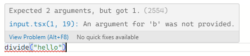

# 타입 스크립트는 어떻게 작동하는가

<aside>
🤔 **`앞서 이야기한 것처럼`**코드를 실행하기 전부터 에러를 잡아내는 부분이 ****개발자에게 있어서 이상적인 부분이라 할 수 있고, 이를 가능하게 하는 것이 타입스크립트의 역할이다.

</aside>

## 배경 지식

우선적으로 타입스크립트에 대하여 조금 더 알아보자면, 우선 타입스크립트는 공식 홈페이지에서
명시되어 있는것 처럼 **strongly typed programming language** 즉 **강타입 프로그래밍 언어**이다

일반적으로 C#, Java, Go Rust 같은 프로그래밍 언어를 학습하였다면, 컴파일러를 떠올릴텐데,
이런 언어들은 코드를 다 작성하고 나면 코드를 컴파일해서 기계가 실행할 수 있는 종류의 코드인0101로 바꿔주거나 어셈블리 코드, 혹은 바이트 코드 되기도 한다.

이와 유사하게 타입스크립트 작성한 코드가 자바스크립코드로 변환되는 것이다.

---

## 왜 굳이 다시 바꾸는 걸까

브라우저는 타입스크립트가 아닌 자바스크립트 형식의 코드만을 이해할 수 있기때문임

타입스크립트 덕분에 개발자가 여러 오류나 문제점 들에서 보호받으며 개발할 수 있는것이고, 그렇게 완성한 타입스크립트 코드는 손쉽게 자바스크립트 코드로 다시 변환하여 브라우저에 적용할 수 있는것이다

---

## 그럼 어떻게 보호하여주는가

컴파일은 그저 작성한 타입스크립트 코드를 일반적인 자바스크립로 바꾸는 것이다.

그러면 그 불안정하다던 자바스크립트 코드를 단지 변환하는 것만으로 충분히 보호를 받을 수 있을까? 하고 의문을 가질 수 있다.

여기서 타입스크립트가 제공하는 보호장치는 타입스크립트 코드가 자바스크립트로 변환되기 전에 발생한다. 타입스크립트가 코드를 먼저 확인하고, 변환된 자바스크립트가 실수를 만들지 않게 확인하는 것이다.

---

## 직접 사용하여 보자

타입스크립트 공식 홈페이지에서 온라인 환경에서 입력한 타입스크립트의 코드를 자바 스크립트 코드로 변환시켜주는 모습을 볼 수 있다

여기서 간단한 예시로 코드를 작성하면 아래와 같다

일반적인 자바스크립트와 같지만 5번줄에서 hello()함수가 선언되어있지 않다고 먼저 오류를 검출해주는 모습을 볼 수 있다

(이 객체 타입에는 hello가 존재하지 않습니다 라고 알려주는 오류창)

그렇다면 처음에 작성하였던 배열과 논리형의 덧셈은 어떻게 될까

정확히 숫자형 배열과 논리형에는 덧셈 연산자를 사용할 수 없다는 경고와 함께
컴파일을 진행하지 않는 모습을 볼 수 있다.

위 사항들을 보면 divide함수에서 확인했던 문제또한 막아준다는 것을 확인할 수 있다

(2개의 객체를 요구하며 오류를 표시하는 모습)

그런데 위에 divde함수에 a,b에도 오류를 나타내는 모습도 볼 수있다.

이는 타입스크립트가 현재 a,b 가 정확히 숫자라는 사실을 선언해달라고 요구하는 중인데,

나중에 더 자세하기 작성하겠다
