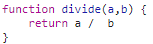

# 타입스크립트의 타입

## 변수에는 타입을 지정해야한다

자바스크립트에서는 단지 변수를 선언해주기만 하면 되기때문에 c나c++같은 변수들에 전부 타입을

지정해줘야 하는 언어들을 먼저 배웠다면 조금은 어색하게 느껴질 수도 있다.

---

## 타입스크립트의 타입 추론

우리는 컴파일러에게 선언한 변수의 타입을 알려줘야 하는데, 타입스크립트는 두가지 접근방식을 결합하였다. 하나는 데이터와 변수의 타입을 명시적으로 정의할 수도 있고, 아니면 그냥 자바스크립트처럼 변수만 생성하고 넘어갈 수도 있다.

여기서 타입스크립트의 장점이 후자의 경우에는 타입을 추론해준다는 것 이다.

예를들어 아래와 같이 변수를 선언해보았다.

```tsx
let a = "hello";
```

이렇게 하기만 하더라도 타입스크립트는 a 타입을 추론해준다. 추론을 거치면 변수a가 string이어야 한다는 것 알게 되는 것 이다.

그렇다면 바로 다음줄에 코드를 추가하여보자.

```tsx
let a = "hello";
a = "bye";
```

물론 타입스크립트는 오류를 표시하지 않는다. 왜냐하면 이미 a가 string이라는것을 알기 때문이다.

그렇다면 a가 string이라는것을 추론하였는지 확인하기 위해서 코드를 한줄 더 추가해보겠다.

```tsx
let a = "hello";
a = "bye";
a = 1;
```




정확하게 타입스크립트가 변수a의 타입을 string이라고 추론하여 3번줄의 코드에 오류를 표시하는 모습이다.

---

다른 접근방식은 타입스크립트에게 구체적으로 알려주는 것 이다.

예를들어 이번에는 boolean 방식의 변수b를 추가하여 string 값을 입력하여 보겠다

```tsx
let a = "hello";
let b: boolean = "bye";
```

이 코드는 다음과 같은 결과를 보여줄 것 이다.


우리가 타입스크립트에게 변수 b는 boolean이라고 명시하여주었기에, string을 입력하려는 코드에 오류를 표시하여 주는 모습이다.

---

## 타입스크립트와 소통하는 방식

위의 b : boolean 형식이 바로 타입스크립트의 문법 중 하나이며, 우리가 type checker와 소통할 수 있는 방식이다.

한가지 예를 더 들어보자면 number 1,2,3을 저장하는 array c를 만들어보자

```tsx
let c = [1, 2, 3];
```

그리고 이 array c에 string “1”을 push하려고 하면?


가능할리가 없다. 타입스크립트는 하나의 변수에 여러가지 타입이 섞여버리는 실수를 사전에 방지하여 주는 것 이다.

하지만 만약에 선언할 때 값이 저장되어 있지 않은 빈 배열이라면, 타입스크립트가 그 변수의 타입을 추론할 수 없기때문에, 명시적 표현이 꼭 필요하다.


---

## 꼭 필요할 때만 사용하자

기본적으로 타입스크립트에게 추론하도록 맡기는 편이 좋다. 여러가지 이유가 있겠지만 결국은 우리가 키보드 치는 시간을 줄일 수 있기 때문이다.

“miku”라는 string 타입의 name요소를 가지고 있는 player 변수를 만들어보면 아래와 같다


여기서 변수명 player에 마우스 커서를 가져다 대면, 타입들을 정확하게 추론해놓은 모습을 볼수있다


