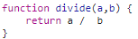
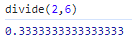
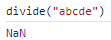
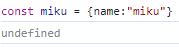
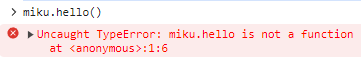

# 자바스크립트로는 부족한가

<aside>
💡 `**왜** **타입스크립트?`**   
타입스크립트는 타입 안정성 덕분에 코드에 버그를 줄이며, 이 점이 타입스크립트가 제공하 는 가장 큰 장점이라 할 수 있다.

</aside>

## 자바스크립트는 매우 유연한 언어이다.

자바스크립트는 개발자가 아무리 괴랄한 코드를 작성한다고 해도, 개발자를 최대 이해하고 도와주려고 한다.

자바스크립트와 타입스크립트는 서로 같은 유형의 타입을 가지고 있지만, 자바스크립트는 에러를
최대한 보여주지 않게 하려고 한다

---

## 그래서 이런 문제도 생긴다.

예를들어 a와b 값을 입력받아 나눈 값을 출력하는 divide 함수를 만들었다고 가정하자.

이 함수를 사용하려면 보통 divide(2,6) 같은 형태로 다음과 같은 출력을 보는게 맞겠지만,

문제는 자바스크립트가 이 함수를 올바르게 사용하는 것을 강제하지 않는다는 점이다.

divide 함수안에 입력값을 2개가아닌, 심지어 숫자가 아닌 문자를 넣으면, 보통 다른 언어의 경우
그 함수의 실행을 막아 줄 것이다. 하지만

어떠한 에러 메시지나 예외처리 없이 단순하게 함수가 실행하여 NaN을 리턴하였다.

---

## 물론 더 심한 문제또한 존재한다

하지만 이런 구문 오류보다도 가장 최악의 케이스는 런타임 에러이다.
런타임 에러는 유저의 컴퓨터가 코드가 실행될 때만 일어나는 에러일 수도 있다

여기 {name:miku} 라는 정보를 가진 miku 변수를 지정하여줬다.

이 변수를 사용하여 선언되어있지않은 함수를 실행하면?

이런식으로 오류를 표시하는 모습이다. 하지만 이는 hello()함수의 존재여부를 검증하지 않고,
코드를 실행시키고 나서 출력되는 오류이다.

---

이러한 오류는 유저의 컴퓨터에서 코드가 실행되면 나타나는 에러이기에 바람직하지 못하다.

좋은 프로그래밍 언어일수록 miku 객체를 분석해서 hello()함수는 존재하지 않기에
위 같은 코드는 실행할 수 없습니 라고 알려줄 수 있어야하고, 이는 이미 다른 프로그래밍 언어에서는 갖춰져있는 경우가 많다.

그래서 타입스크립트가 이러한 자바스크립트의 잘못된 점을 지적 해주며 개발자를 보호하여주기에

웹 개발자들에게 필수가 된 것이다
